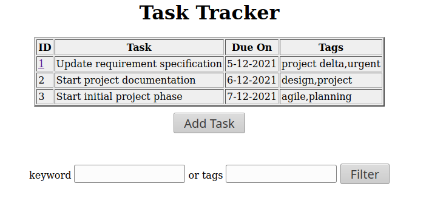
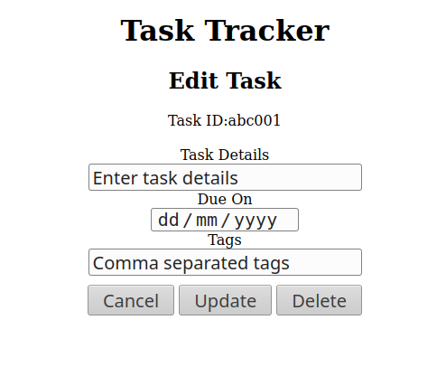
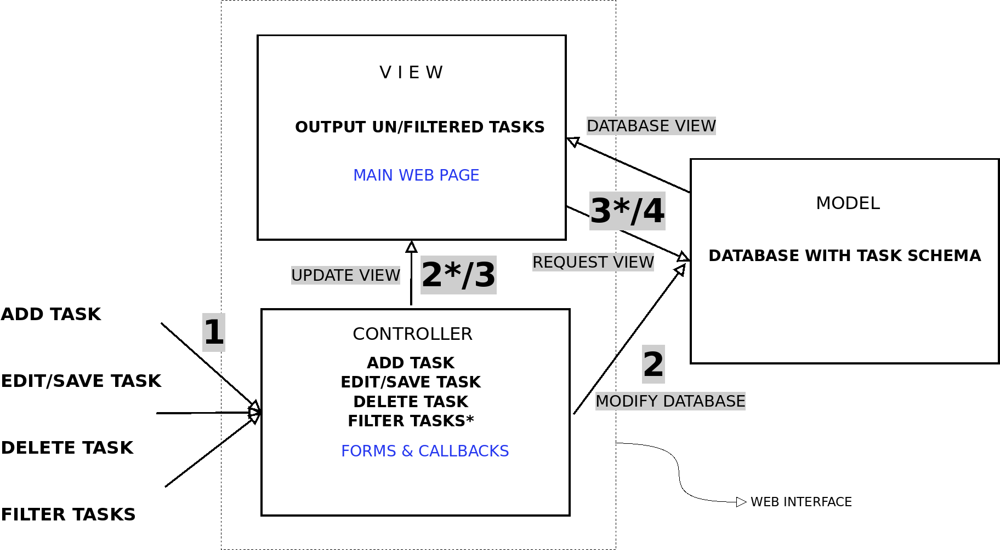
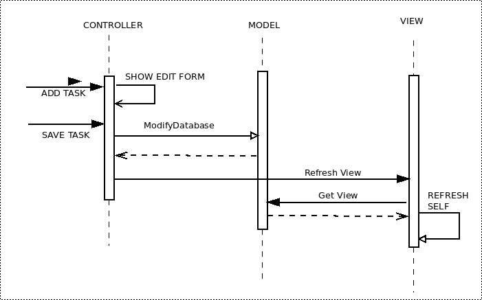

# Requirements

## Purpose

The objective is to write a simple browser based task tracker for the typical
software developer.

## User Stories

We document typical user stories.

1. **Record a task:** Joe wants to record a task to be done. He wants to record the task 
that he is doing. He tells the task tracker to record his task. The task tracker records
the task and stores it in the local memory. When Joe wants to record a task, he simply
presses the record button. All the tasks and events that Joe is performing gets stored
in one place where he can go there and recall all his previous actions.

2. **Update a task** Joe wants to update a task. He does that simply by doing and updating the 
task in the specified location. 

3. **Delete a task:** Joe wants to delete a task he has finished. He does this by pressing
a delete button on his software console. He deletes a task by selecting the task that
he wants to delete and presses the delete button. By doing this, the previous tasks that
Joe considers as unnecessary is deleted. 

4. **List pending tasks:** Joe wants to list pending tasks. He does this by pressing
the list button on his console. By pressing this button, Joe knows what actions are pending
to be done. 

## Functional Requirements

1. Recording a task: Task tracker shall persistently record one or more tasks.
2. Updating a task: It shall be possible to edit/update the already recorded tasks.
3. Deleting a task: It shall be possible to delete a recorded task.
4. Listing tasks: Recorded tasks can be searched using search criteria (preferably tags)

## Non Functional Requirements

1. Ease of use: The system shall be easy to use and as easy as operating a webpage.
2. Usability: System shall be usable on touch as well as pointer devices. The screen should
be "zoomable" like a standard browser page.


# Design 


## External Interface Description

We document the following in this section: 

- The user inputs to the system.
- The system responses.

<!--Table1-->

User input(main screen)              System Response
----------                           ----------------
1. Add a task                        1. Show the task entry/update form.
2. Select a task for edit/delete.    2. Show the task entry/update form.
                                        (Form is prepopulated with task details)
---------------------------------------------------------

: User-System Interaction-1

<!--Table2-->

User input(Edit task screen)                System Response
----------                                  ----------------
1. Add/modify a task.Press save/update      1. Close the task entry/update form. 
                                               Update task and update list on main page.
2. Delete a task.                           2. Close the task entry/update form.
                                               Delete task and update on main page.
---------------------------------------------------------

: User-System Interaction-2


<!--Table3-->

User input(Filter field)                    System Response
-----------------------                     -----------------
User enters the keyword and tags and        System filters the system input and 
presses filter.                             returns the output.


: User-System Interaction-3






\newpage

## Architectural Design

We use the Model-View-Controller (MVC) architecture for this project. Refer to 
Figure \ref{collab} for the system-level interaction diagram.

{width=500px}

The Figure \ref{seqdia} shows a typical sequence diagram for a user button press.

{width=500px}


## Detailed Design

Here we describe the code and logic used to achieve specific functionality
in the design.

### Model/Database schema

Our schema has four text columns: `aID, bTask , cDueOn , dTags` of which
`aID` is the key field.

### Generating random task ID

We use the following approach to generate random task IDs.

```{.javascript .numberLines}
function addTask() {  //generate a task ID and pop the edittask form
    mytaskid = Math.random().toString(36).substring(2,7);
    document.getElementById("taskid").innerHTML=mytaskid;
    switcher();	 
}
```
### Search function

We read the search keyword and replace all characters in the stoplist with a `|`.
Essentially we are OR'ing before forming the regular expression. Next we search the
Task and Tag fields for this expression. Next the task table updates with this filtered
view. 

```{.javascript .numberLines}
    mykw_raw = document.getElementById("searchtag").value;
    stoplist = /[\s,:;'"]+/g;
     //Replace stoplist with pipe for OR'ing the keywords
    mykw = mykw_raw.replace(stoplist, '|'); 
    // convert mykw to a regular expression
    mykwregex = RegExp(`${mykw}`,'i');
    tasklistarray=mytaskdb([{bTask:{regex:mykwregex}},
    {dTags:{regex:mykwregex}}]).order("cDueOn").select("aID",
    "bTask","cDueOn","dTags");
    GenerateTable();
```

# Concluding note

*Kelasa* is a simple task tracking web application. However, since it uses the browser
database it is tied to the particular browser and its own name as the HTML file. You
continue to have persistent access to your task list as long as you stick to the same
browser and keep the HTML file name unchanged.
